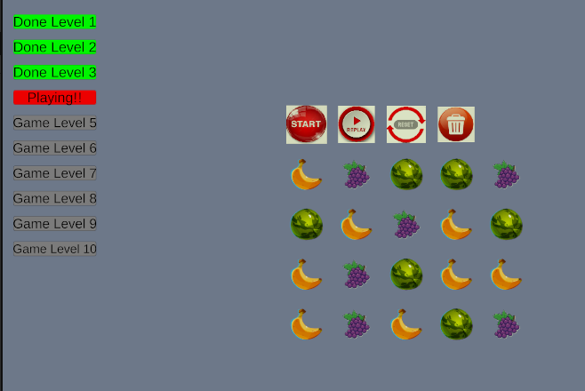

# Unity 2D Grid Game

## Screenshot

This is my Unity 2D puzzle game project created for my assignment.

## Features
- Grid-based movement
- Simple UI
- Puzzle mechanics

## Controls
- Add your controls here (e.g. mouse click, keyboard arrows)

## How to run
1. Open the project in Unity Hub
2. Open the scene (e.g. GameScene)
3. Click Play

## Author
Your Name